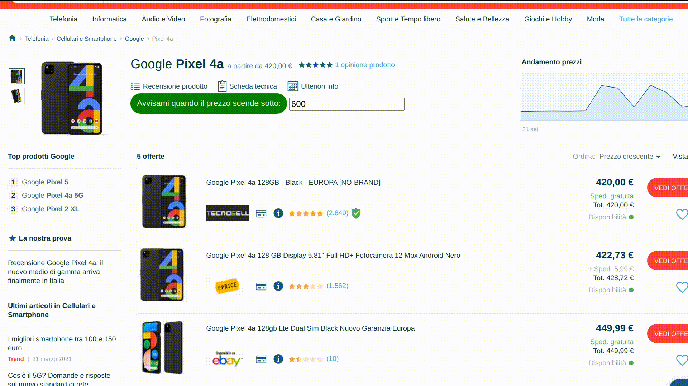

Script che controlla il prezzo di un prodotto tramite trovaprezzi.it
-------------

### Features
- Script che chiede all'utente tramite Command Line il nome di un prodotto
- Lo script aprira una pagina web (url= trovaprezzi.it)
- Ricerca automatica del prodotto richiesto
- L'utente potra indicare un prezzo massimo che è disponibile a pagare per quel prodotto
- Lo script controllera in automatico il prezzo ogni ora e inviera un'email nel caso in cui il prezzo dovesse scendere sotto il prezzo indicato dall'utente

